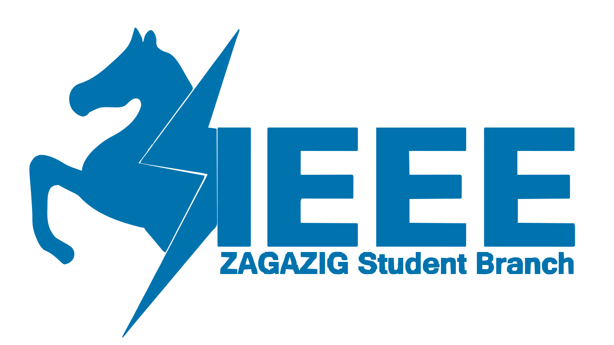

<center>
 the official events and competitions gate for IEEE Zagazig student branch.

[](https://app.netlify.com/projects/ieee-zsb-events/deploys)

</center>


## Getting Started

Run the development server:

```terminal
$ yarn
$ yarn dev
```
Open [http://localhost:3000](http://localhost:3000) with your browser to see the result.

## Contributing

We welcome contributions from the community! read [the guidelines](./GUIDELINES.md) to know more about our workflow. 